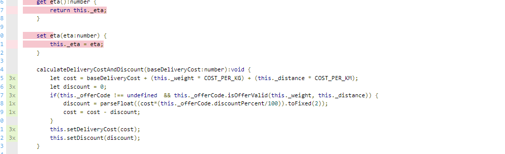
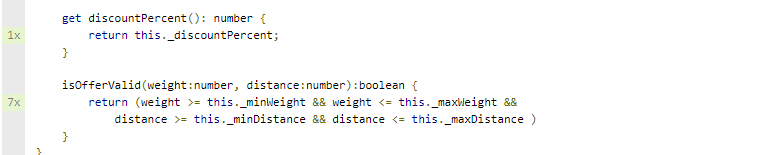
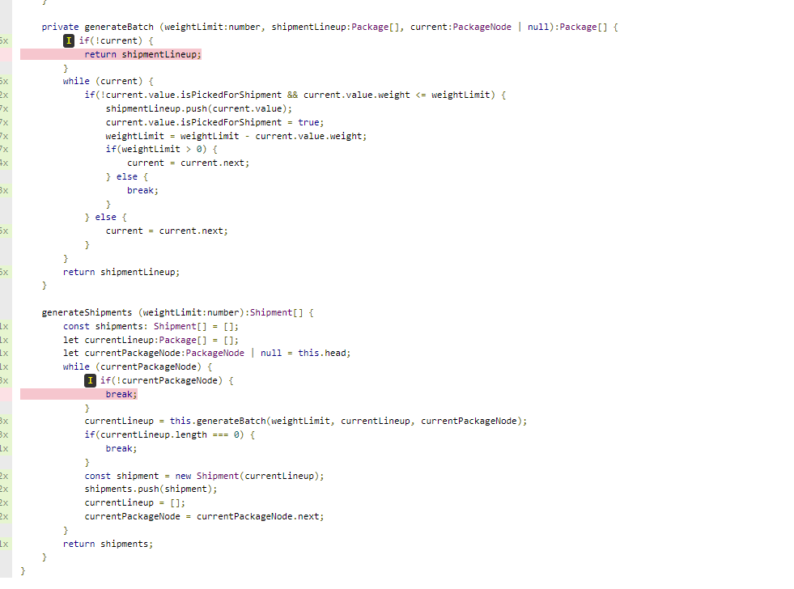

  # Kiki and Tombo's Delivery Services 
  This application is to help Kiki and Tombo to 
  comeup with optimal way to deliver packages with available number of vehicles, 
  by prioritising packages based on their weight and destination distance.
  And, finally provide the discount applied, total delivery cost and ETA of each package.
  Below are the conditions set by Kiki and Tombo to prioritise the deliveries and boost their business.
  1. One offercode can be applied per package
  2. Apply discount only if offercode conditions are met
  3. The delivery partners will have identical vehicles. i.e, their max speed and maximum weight limit is same across all vehicles
  4. Each delivery partner can carry multiple packages at a time, and there are certain strategies involved in selecting packages together to form a shipment.
     Shipment Selection strategies:
     a. Shipment should contain max packages that a vehicle can carry
     b. Prefer to deliver heavier shipments when there are multiple shipments
     c. If weights of shipments are same, then prefer one with shorter distance.
    
  ## Installation steps
  Node Version used: v16.13.1
  `npm install`
  `npm run start`

  
  ## Inputs and Expected Outputs
  The App is run in command line, and expects the input to be in the following manner:   
    ```base_delivery_cost no_of_packges
    pkg_id1 pkg_weight1_in_kg distance1_in_km offer_code1
    …
    no_of_vehicles max_speed max_carriable_weight```             
    Eg:```100 3 PKG1 50 30 OFR001 PKG2 80 80 OFR002 PKG3 30 50 OFR003 2 70 100```

  Expected Output:        
    PKG1 0 750 0.43 <br> 
    PKG2 0 1300 1.14<br>
    PKG3 32.5 617.5 0.71<br>

      
  ## Tests  
   Run `npm run test` command to run the tests.
   
  I have written tests for the following:                  
   1. `calculateDeliveryCost` function within Package class. This function is used to calculate the discount applied and total delivery cost.
    
  2. `isOfferValid` function in OfferCode class
    
  3. `generateBatch` and  `generateShipments` functions within PackageList class which forms the basis for Shipment pickup within Order
    

